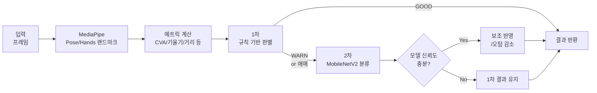

# 🧍 AI Inference Server (FastAPI)

Keras(H5) 모델 아티팩트(`.h5`)와 클래스 매핑(`class_indices.json`)을 기반으로, <br/>
입력 프레임에서 **사용자 자세를 판별**하고 전처리 → 추론 → 결과를 표준 포맷으로 반환하는 **AI 추론 백엔드 서버**입니다.  
웹 백엔드에서 호출 가능한 API를 제공하며, 파일럿 검증 지표(Accuracy/F1 등)와 재현 가능한 평가 흐름을 함께 관리합니다.
> Real-time posture analysis inference backend (rule-based + model-based verification)

<br/>

- 주요 목적: **자세/동작(이미지) 분류 및 판별 결과 제공**
- 제공 기능: **헬스 체크, 단일 추론, (선택) 성능 평가/리포트 생성**
- 모델 아티팩트: `my_model.h5`, `class_indices.json`

---

## 🛠️ 기술 스택

- **Languages** : 
  
- **Frameworks** : 
- **Data / ML** :


- **Computer Vision** : 


- **DevOps / Infra** :    


---

## ✅ 구현 기능 요약

- **자세 분석 API**
  - 입력(이미지/프레임)을 받아 **하이브리드 판별(규칙 기반 + 필요 시 모델 검증)** 수행
  - 최종 상태(`state`), 위반 코드(`violations`), 신뢰도/심각도(`violation_details`), 코칭 메시지(`advices`), 핵심 메트릭(`metrics`) 반환
- **모델 로딩 및 런타임 관리**
  - 서버 부팅 시 모델/리소스 로딩(콜드 스타트 최소화)
- **검증/평가**
  - 테스트셋 기반 성능 지표(Accuracy/F1 등) 산출 및 혼동행렬 기반 검증
- **운영/배포**
  - 헬스 체크 엔드포인트 제공
  - Docker 기반 실행 및 AWS EC2 배포(Nginx 리버스 프록시)
  - GitHub Actions 기반 CI/CD(빌드/배포 자동화)

---

## 📂 프로젝트 구조

<details>
  <summary><b><i>폴더/파일 트리 펼쳐보기</i></b></summary>

```text
.
├── .github/
│   └── workflows/                  # CI 파이프라인(테스트/빌드/배포)
├── scripts/                        # 학습/평가/유틸 스크립트(전처리/벤치마크 등)
├── src/
│   └── app/                        # FastAPI 추론 서버(라우터/파이프라인/모델 런타임)
│       ├── main.py                 # FastAPI 앱 엔트리포인트(uvicorn 실행)
│       ├── api/
│       │   ├── routers/
│       │   │   └── posture.py      # 자세 분석 API 라우터(/analyze, /landmarks, /health)
│       │   └── schemas.py          # Pydantic 요청/응답 DTO(스키마)
│       ├── core/
│       │   ├── config.py           # 설정 로딩(환경변수), 모델 경로, CORS 옵션
│       │   ├── logging.py          # 구조화 로깅(JSON) 및 요청 상관관계(request_id) 처리
│       │   └── errors.py           # 커스텀 예외 타입 및 전역 예외 핸들러
│       ├── services/
│       │   ├── pipeline.py         # 전체 처리 파이프라인 오케스트레이션(입력→추론→응답)
│       │   ├── detector.py         # MediaPipe Pose 래퍼(랜드마크 추출/전후처리)
│       │   ├── tracker.py          # 프레임 샘플링/스로틀링 및 시계열 스무딩(EMA/칼만)
│       │   ├── metrics.py          # 랜드마크 기반 자세 메트릭(각도/거리/정렬)
│       │   ├── calibration.py      # 사용자/카메라 캘리브레이션(초기 기준선 정규화)
│       │   ├── classifiers/
│       │   │   ├── base.py                   # 분류기 공통 인터페이스(IFitClassifier)
│       │   │   ├── uneven_shoulders.py       # 한쪽 어깨 기울어짐 자세 판별
│       │   │   ├── upper_body_tilt.py        # 상체 기울임(좌/우) 자세 판별
│       │   │   ├── head_tilt.py              # 머리 기울임 자세 판별
│       │   │   ├── too_close.py              # 카메라와 너무 가까움 자세 판별
│       │   │   ├── leaning_on_arm.py         # 팔로 턱/머리 지지 자세 판별
│       │   │   ├── asymmetric_posture.py     # 비대칭 복합 자세 판별
│       │   │   ├── forward_head.py           # 거북목 자세 판별
│       │   │   └── train_model.py            # 분류 모델 오프라인 학습/평가 엔트리
│       │   ├── aggregator.py       # 분류 결과 집계 및 응답 페이로드 구성
│       │   ├── advisor.py          # 상태→코칭 문구/콘텐츠 ID 매핑
│       │   └── exporter.py         # 결과 퍼블리시 훅(웹훅/큐/로그 등 연동 지점)
│       └── tests/
│           ├── test_pipeline.py         # 파이프라인 단위 테스트
│           ├── test_classifiers.py      # 분류기 로직 단위 테스트
│           └── fixtures/                # 테스트 픽스처(샘플 입력/기대 출력 등)
├── class_indices.json              # 클래스 인덱스 ↔ 라벨 매핑
├── my_model.h5                     # 학습된 모델 아티팩트
├── Dockerfile                      # 컨테이너 이미지 빌드 정의
├── requirements.txt                # 파이썬 의존성 목록
├── .dockerignore                   # Docker 빌드 제외 규칙
├── .gitignore                      # Git 추적 제외 규칙
└── README.md
```
</details>

---

## 🔌 API 명세

### `POST /analyze`
입력 이미지/프레임을 분석해 자세 상태(state), 위반 항목(violations), 코칭 메시지(advices), 핵심 메트릭(metrics) 을 반환합니다.

- **Request**
  - `Content-Type: multipart/form-data`
  - Body: `image` (file, required): 분석할 이미지(JPG/PNG)

  ```bash
  curl -X POST "http://localhost:8000/analyze" \
    -F "image=@sample.jpg"
  ```

  <details>
    <summary> <i>Response 200</i> </summary>

  ```json
  {
    "state": "WARN",
    "violations": ["UNEQUAL_SHOULDERS", "UPPER_BODY_TILT"],
    "violation_details": [
      { "code": "UNEQUAL_SHOULDERS", "severity": 2, "confidence": 0.3390 },
      { "code": "UPPER_BODY_TILT", "severity": 2, "confidence": 0.3357 }
    ],
    "advices": [
      {
        "code": "UNEQUAL_SHOULDERS",
        "message": "어깨 높이가 서로 달라요. 양쪽 어깨를 천천히 으쓱였다 내리면서 균형을 맞춰 볼까요?",
        "content_id": "POSTURE_UNEQUAL_SHOULDERS"
      },
      {
        "code": "UPPER_BODY_TILT",
        "message": "상체가 한쪽으로 기울어져 있어요. 엉덩이를 의자 가운데에 두고 양쪽 골반에 균등하게 힘을 실어 주세요.",
        "content_id": "POSTURE_UPPER_BODY_TILT"
      }
    ],
    "metrics": {
      "shoulder_line_angle_deg": 6.576,
      "head_line_angle_deg": 8.143,
      "shoulder_height_diff": 0.0410,
      "forward_head_amount": 0.2194,
      "face_scale_raw": 0.0706
    },
    "timestamp_ms": 1765185101907
  }
  ```
  </details>

- **Field**
  - `state`: 최종 상태 (`GOOD` | `WARN` | `UNKNOWN`)
  - `violations`: 감지된 자세 문제 코드 목록(우선순위 순)
  - `violation_details`: 위반 항목별 심각도/신뢰도
  - `severity`: 1~{N} (높을수록 심각)
  - `confidence`: 0~1 (판별 신뢰도)
  - `advices`: 위반 항목별 코칭 메시지 및 콘텐츠 매핑
  - `metrics`: 자세 판단에 사용된 주요 수치(각도/차이/거리 등)
  - `timestamp_ms`: 결과 생성 시각(ms)

- **Error**
  - `400`: 이미지 누락/형식 오류
  - `415`: 지원하지 않는 포맷
  - `500`: 서버 내부 오류

### `GET /health`
  - 서버 헬스 체크
    ```bash
    curl -X GET "http://localhost:8000/health"
    ```
---

## 🧩 판별 로직: 규칙 기반 + 모델 기반

본 시스템은 <b>실시간성(낮은 지연)</b>과 <b>판별 신뢰도(오탐/미탐 최소화)</b>를 동시에 확보하기 위해, <br/> **1차 규칙 기반 판별**과 **2차 모델 기반 검증**을 결합한 하이브리드 구조로 동작합니다.

### 설계
- **1차 (규칙 기반)**: MediaPipe Pose/Hands 랜드마크로 메트릭을 계산해 **빠르고 해석 가능한 자세 판정** 수행
  <details>
    <summary> <i>판별 기준</i> </summary>
  
    - **거북목(Forward Head)**
      - 지표: CVA(두개척추각) 기반 평가
      - 구현 포인트: 웹캠 좌표계 차이를 줄이기 위해 어깨폭 정규화 적용

    - **어깨/머리/상체 기울임 등 비대칭 자세**
      - 지표: 포토그래메트리(landmark 기반)로 머리/목/어깨/흉추 각도 지표 산출
    
    - **화면과 너무 가까운 자세**
      - 지표: 눈-화면 거리(또는 얼굴-카메라 거리 proxy) 기반
      - 기준 예: 작업관리지침 권고(예: 40cm 이상 확보)에 준하여 임계값 설정
  
  </details>

- **2차 (모델 기반)**: 1차 결과가 애매한 경계 상황일 시 **MobileNetV2 분류 모델로 추가 검증**하여 **오탐 감소 및 신뢰도 보강**
  <details>
    <summary> <i>상세 설명</i> </summary>
  
  - **모델 사용 이유**: 규칙 기반이 어려운 케이스(복합 자세, 랜드마크 노이즈, 경계 상황)에서 오탐 감소 및 판단 보조
  
  - **모델 선택 이유**: 경량성/실시간성을 고려한 MobileNetV2 채택
    
  - **학습 방식**: 웹캠 환경에서 수집한 자세 이미지로 멀티클래스 분류 학습, ImageNet 가중치로 전이학습(Transfer Learning) 적용
    
  </details>

- **결합 방식(Fusion/Gating)**: 아래 원칙을 기반으로 결합하여 **실시간성, 신뢰도 확보**
  <details>
    <summary> <i>결합 원칙</i> </summary>

  - **트리거 조건**
    - 규칙 기반이 WARN을 반환했거나
    - 규칙 기반 메트릭이 임계값 근처(경계값)로 “애매” 판정이거나
    - 복합 자세로 분류 불확실성이 큰 경우
      
  - **반영 조건**
    - 모델 신뢰도(softmax max prob)가 충분히 높을 때만 결과를 반영
    - 신뢰도가 낮으면 규칙 기반 결과를 유지(보수적 정책)
  
  </details>


---

## 🧠 모델 정보
### 모델 아키텍처
- Backbone: **MobileNetV2 (ImageNet 사전학습, include_top=False)**
- Head: **GlobalAveragePooling2D → Dropout(0.2) → Dense(softmax, num_classes)**
- 입력 크기: **224 × 224 × 3 (RGB)**

### 전처리/증강 
- 전처리: MobileNetV2 preprocess_input 적용
- 데이터 증강(훈련 시):
  - `rotation_range=10`
  - `width/height shift=0.05`
  - `zoom=0.1`
  - `horizontal_flip=True`

### 학습 전략 
- 데이터 로딩: `ImageDataGenerator.flow_from_directory` + `validation_split=0.2`, `seed=42`
- 1단계(헤드 학습): backbone freeze, **Adam(1e-3)**, `epochs=10`
- 2단계(파인튜닝): backbone 일부 unfreeze(뒤쪽 30 레이어), **Adam(1e-4)**, `epochs=5`

### 산출물(Artifacts) 
- `my_model.h5`: 학습된 모델 파일
- `class_indices.json`: 폴더 기반 클래스 매핑(추론에서 동일하게 사용)

---

## 📈 검증 결과 (파일럿 테스트)

> 테스트 샘플 수: n=633 <br/> 클래스: WARN(문제 자세) / GOOD(정상 자세)


### 핵심 지표 (WARN을 Positive로 가정)
- Accuracy: 89.89% (569/633)
- Recall(WARN): 93.33% (448/480)
- F1(WARN): 93.33%

<details>
  <summary><b><i>지표 상세</i></b></summary>
  
  - Precision(WARN): 93.33% (448/480)
  - Specificity(GOOD): 79.08% (121/153)
  - FPR(오경고율): 20.92% (32/153)
  - FNR(미탐율): 6.67% (32/480)
  - Balanced Accuracy: 86.21%
    
</details>

---

## 🚀 배포 (Docker on AWS EC2)

- AWS EC2에 Docker로 배포하여 운영합니다.
- Nginx를 리버스 프록시로 사용해 HTTP(필요 시 HTTPS) 엔드포인트를 제공하고,
  프론트엔드와의 연결을 위한 라우팅/포트 포워딩을 구성했습니다.
- GitHub Actions를 통해 빌드/배포를 자동화하여 코드 변경 시 EC2에 반영되도록 구성했습니다.

